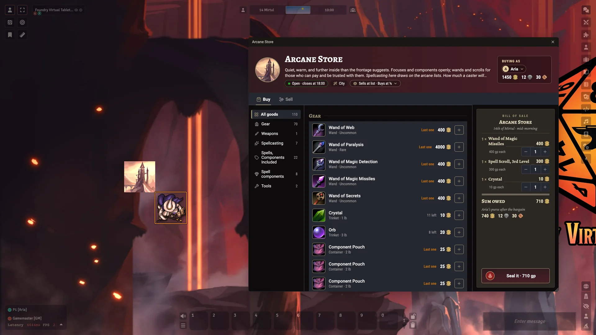
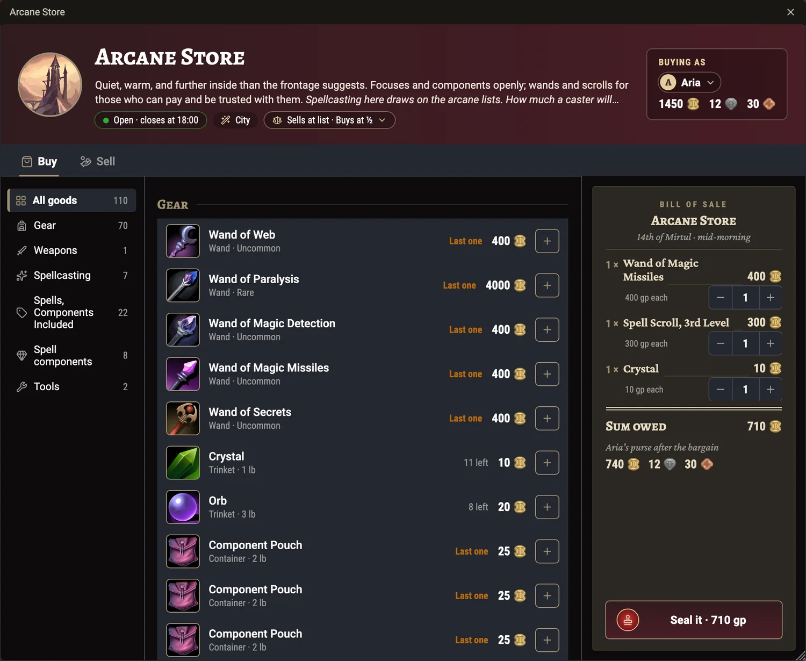
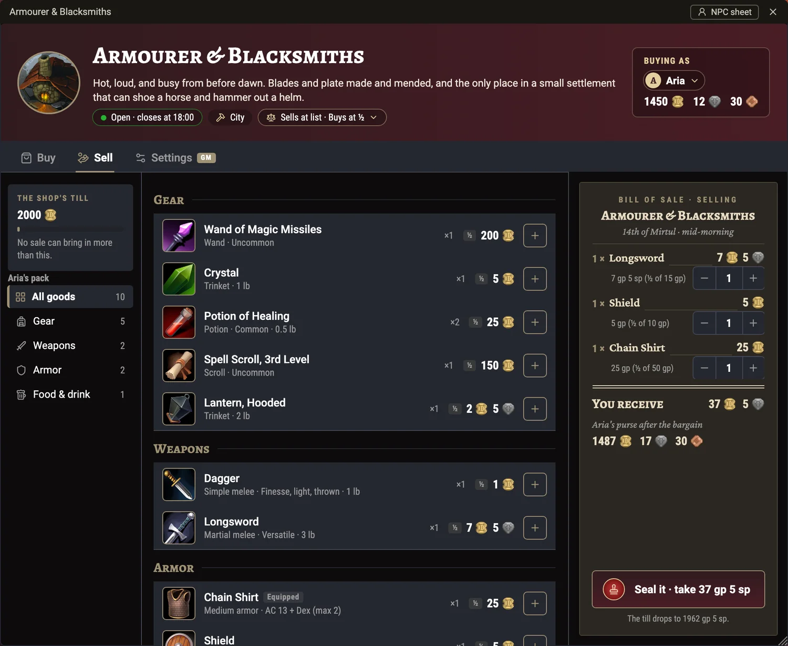
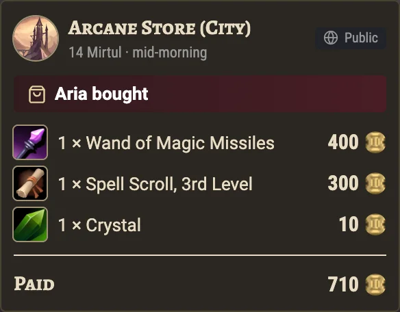
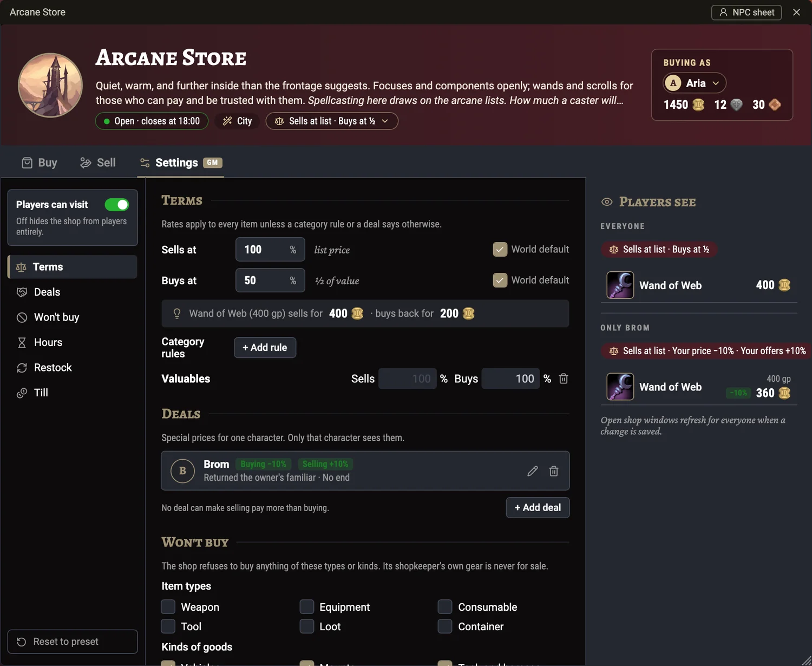

# Merchant Presets — Shops for 5e


[](https://github.com/mikiross87/merchant-presets/actions/workflows/ci.yml)
[](LICENSE)

A module for **[Foundry Virtual Tabletop](https://foundryvtt.com/)** v14 and the
**dnd5e** system.

Seventeen ready-made shops: drag one out, drop a token, and your players can
shop. No other modules required. Each comes in Village / Town / City sizes —
**51 merchants, 1,551 stock lines** — with its own shop window, stock that runs
out and comes back, a purse that runs dry, and hours it keeps.



Built entirely from **SRD 5.2** (CC-BY-4.0) plus this module's own goods, so it
works in any `dnd5e` world and redistributes no paid content.

Inspired by the free homebrew *Stores for D&D 2024* by
[The Inspired Arcana](https://www.patreon.com/TheInspiredArcana) — worth your
time, and worth a follow.

## Install

Paste this manifest URL into Foundry's **Install Module** dialog:

```
https://github.com/mikiross87/merchant-presets/releases/latest/download/module.json
```

## Requirements

| | |
|---|---|
| System | `dnd5e` 5.3.0+ |
| Optional | `simple-nutrition-5e` 1.0+, for meals and food that feed characters |

No book modules are needed, or used. The Player's Handbook and Dungeon Master's
Guide modules are not consulted even when installed.

## Compendiums

All three sit in a **Merchant Presets** compendium folder.

- **Merchants** (Actor) — 51 statted shopkeepers in `Village` / `Town` / `City` folders.
- **Shop Stock Tables** (RollTable) — one stock list per shop per size.
- **Merchant Goods** (Item) — 127 goods no 2024 book ships as items.

## Usage

Drag a merchant out of the compendium into the Actors sidebar, rename it to
whatever the local shopkeeper is called, and drop a token on the scene. On
arrival the shop rolls its own stock for its size, so two copies of the same
shop differ. Players double-click the token to shop. Dragging in a shop the
world already holds asks whether to replace it or create a new actor; either
works.

Players shop at the counter. A shop stays out of their Actors sidebar, and a
player opens it by double-clicking its token while a token of theirs stands
within 5 ft of it: beside it or diagonal to it, measured from a large stall's
edge. Too far away, they're told to step up to the counter. Walking away
closes the window, and *Buying as* lists only the characters standing there.
The GM checks the distance again for every trade, so a window left open can't
buy from across the map. The shop's *Players can visit* switch turns a shop
off entirely, and a player you give a permission of their own on a shop can
open it from anywhere: a player-merchant, or a fence who deals with one rogue.

For games without a map, set *Shop access* to *From anywhere* in Configure
Settings. Placing a shop's token then opens it to every player, from the
sidebar too (Limited permission). Switching the setting brings every shop in
the world into line with it. The double-click at the counter uses
[libWrapper](https://foundryvtt.com/packages/lib-wrapper) when it's installed,
and works without it.

### The shop window



- **Buy** — the stock by category, with what's left of each, and a running
  **Bill of Sale** that totals the basket and shows what's left in the buyer's
  purse. *Seal the bargain* makes the trade.
- **Sell** — everything the character carries, split into what this shop will
  buy (and for how much) and what it won't touch, with the reason.
- **Up top** — the shop's hours, size and terms of trade: what it sells and buys
  at, with a worked example, any category rules, and what it won't buy.
- **Who's buying** — a player picks which of their own characters they're
  trading as; a GM can trade as anyone.



A trade is carried out by a GM's client, so **a GM has to be logged in**. With
none, the window says so and keeps the bill for when one arrives. Goods, coin
and stock all move at once, two players can't both buy the last one, and a
trade sent twice over a flaky connection only happens once. Each trade posts a
receipt in chat — public, whispered to the GMs, or none, by the *Trades in chat*
setting.



### Settings (GM)

The window's GM-only **Settings** tab changes the shop. Each change saves as
you make it, and every open window reprices at once:



- **Terms** — what it sells and buys at, or *World default* to follow the
  world's *Shops sell at (%)* and *Shops buy at (%)* settings; and category
  rules, such as Valuables at full value.
- **Deals** — one character's own price here: cheaper when they buy, more when
  they sell, or both, with a note and an optional end (when the shop next
  closes, after some days, or never). Only that character sees it. No deal can
  make selling pay more than buying. The note is never shown to players, but
  it's saved on the shop, so a player could read it from the browser console.
- **Won't buy** — item types and kinds of goods the shop turns away.
- **Hours** — when it opens and closes, or open around the clock.
- **Restock** — how often, whether it re-rolls or tops up, and *Restock now*.
- **Players can visit**, and **Reset to preset** to put the shop back as it
  shipped (its deals stay).

The *NPC sheet* button in the window's header opens the dnd5e stat sheet.

### Your own NPCs as shops

Already have a shopkeeper — Sister Garaele in Phandelver, say? Right-click her
in the Actors sidebar and choose **Set up as shop…**. Pick one of the shops and
a settlement size, tick the items she should keep as her own gear, and confirm.
Everything physical left unticked — weapons, armour, equipment, consumables,
tools, loot, containers and what's in them — is deleted for good, so read the
dialog's warning before you click through.

She becomes that merchant: stock rolled for the size you chose, its buying
rules, prices, purse, trading hours and restock schedule. Her name, portrait,
stat block (spells and features included) and token don't change, and the gear
she kept never shows up in the shop window and survives a restock, exactly like
a shipped shopkeeper's own weapon and armour.

Setting her up again, with another shop or another size, keeps whatever gear
she's already holding — the dialog only offers her gear this time round — and
replaces the stock. Anything added to her since the last setup, spells and
features included, goes with the old stock: she comes back as she was set up.
There's no one-click way to undo the setup.

The dialog is a thin wrapper around the module's API, so a macro can drive it
too — physical items left out of `keepIds` are deleted, same as the dialog's
unticked items, so an empty array strips all of a fresh NPC's gear:

```js
game.modules.get("merchant-presets").api.setUpShop(actor, merchantUuid, keepIds)
```

It resolves to the number of stock lines the shop holds, or `null` when it
couldn't set the shop up (the GM's console says why) or no GM answered in time.
A setup that went unanswered may still finish, so check the NPC before running
it again; `api.requestSetUp(actor, merchantUuid, keepIds)` takes the same
arguments and tells the two apart (`status` is `done`, `failed` or `no-answer`).
The setup is carried out by the GM's tab that runs trades and restocks, so the
three never overlap on the same shop.

### The shops

Adventurers' Store · Alchemists & Apothecaries · Arcane Store · Armourer &
Blacksmiths · Criminal & Illicit Store · Dock · Druidic Store · Fletcher &
Woodworker · General Store · Inn & Tavern · Jeweler · Leatherworker · Musical
Store · Stable · Tailor & Textile Store · Temple & Faith Store · Tinkering Store

### The shopkeepers

Every merchant is a working NPC, not an empty till. Each shop and size is statted
from an SRD 5.2 block, so the counter escalates with the settlement: a village
smith is a **Commoner** with a hammer, a town smith a **Warrior Infantry**, a city
smith a **Warrior Veteran**. A village arcane shop is a commoner; the city one is
a **Mage**. Criminal & Illicit runs Bandit → Spy → Bandit Captain, the Dock runs
Commoner → Pirate → Pirate Captain.

That means a shopkeeper has ability scores to roll against when the party tries
to haggle, lie or intimidate, and real AC, hit points and actions if the party
decides to rob the place instead.

Their gear is on the stat block, not the shelf — the smith's warhammer and splint
armour never appear as stock, and a restock will not sell, re-roll or delete
them. The whole shopkeeper comes from `dnd5e.actors24`, the same SRD 5.2 the
stock does, so nothing here needs a book module either.

### Merchant Goods

127 items the 2024 rules describe in their *Food, Drink, and Lodging*,
*Spellcasting Services* and *Mounts and Vehicles* tables, or in their spells'
material components, but never publish as items — ale, bread, cheese, wine,
meals, lodging, mounts, vehicles, saddles, stabling, feed, ship passage,
spellcasting services and spell components. Without them the Inn & Tavern,
Stable and Dock would have almost nothing to sell.

Prices and weights are the SRD's, verified line by line against those tables and
that spell text, so 124 of them are marked `SRD 5.2 · CC-BY-4.0` even though this
module authors the item document — the content is the SRD's, and CC-BY asks to
be told so.

The eight animals are the one place the SRD does publish the thing itself — as a
stat block in the system's own SRD actor compendium, not as an item. So with the
*Bought animals are added to the world* setting on (it is by default), buying a
riding horse copies the SRD Riding Horse into the world as an actor in a
*Purchased Animals* folder, owned by whoever owns the buying character, and the
item in their pack becomes the bill of sale, linking to the creature. Nothing is
placed on a scene; the GM drags it in from the sidebar. Selling the deed back to
a stable is money only — the animal stays for the GM to remove or keep.

Three carry no source at all, being neither in the SRD nor in the 2024 rules: the
two coach rides and the road toll, carried over from the 2014 *Services* table
because the shop guide sells them.

The 43 spell components are the ones SRD 5.2 spells name with a price, one item
per component and price, so a single Diamond Dust (100 GP) serves both
Stoneskin and Greater Restoration. Each says which spells use it and whether
casting uses it up. The Jeweler carries the gems, art and trade goods; the
Temple & Faith Store incense, divination tools, a reliquary, and the diamonds
and diamond dust its healing spells need; the Arcane Store incense, inks,
ivory, silver and scrying foci; the Alchemist mushroom powder, and a city
Druidic Store rare oils. They are limited
stock, so they sell out and restock like the poisons and scrolls. A Holy Symbol,
Holy Water and Ink are already on the shelves as SRD equipment, and components
made to order — statuettes, Clone's vessel, Secret Chest's chest — are not
stocked.

Spellcasting is sold by level, and SRD 5.2 adds the cost of any expensive
components on top. So the spells with a priced component are also sold by
name, with the component in the price: *Spellcasting: Revivify* is the level 3
service's 300 GP plus the 300 GP diamond, 600 GP. That's 31 spells: the ones
that work without the caster, so the buyer walks out with the benefit. The
other 25 are listed in `data/spellcasting.json` with the reason:
- the caster keeps the benefit, as with Find Familiar or Shapechange
- the caster would have to come along, as with Warding Bond, which protects only
  within 60 feet of them
- the spell is tied to the caster some other way, as with Awaken, whose creature
  is charmed by the caster

Those, and every other spell, are bought by level, adding any expensive
components the buyer doesn't bring. The shop window lists the named spells
under their own *Spells, Components Included* heading, below the level
services. Each shop hires out the spells on its classes' SRD spell lists: the
Arcane Store the sorcerer, warlock and wizard's, the Druidic Store the druid
and ranger's, the Temple & Faith Store the cleric and paladin's. Each spell is
available where its level is: levels 1–2 in a village, 3–5 in a town, 6–9 in a
city.

A service moves gold and nothing else, so with the *Bought spellcasting is
announced in chat* setting on (it is by default) the shop says in chat which
spell it casts and for whom: "Temple & Faith Store (Town) casts Raise Dead for
Aria." The spell is linked. So are any effects it carries that go on a creature,
such as Raise Dead's Resurrection Sickness, and the GM drags them onto whoever
the spell was cast on. A service sold by level asks the buyer to tell the GM
which spell. Nothing is applied automatically, since the buyer is often not the
target. The message carries no price, because the trade's own receipt shows
it, and it's whispered to the GMs when the *Trades in chat* setting whispers
receipts.

To have a spell use up its component, give the spell's activity a Material
consumption target: on the *Activation* tab, under *Consumption*, add a target
of type *Material* and pick the component from the character's inventory. On a
spell that is not on a character sheet yet, enter the component's identifier
instead, such as `diamond-300`, and dnd5e links it to the matching item once the
spell is on a sheet. Casting then offers to use the component, lowers its
quantity, and refuses the cast without one. The module does not set this up
itself.

Ale, bread, cheese and wine are weighted consumables so Simple Nutrition 5e
counts them as meals; their weights are chosen for that (nutrition equals weight
in pounds) rather than taken from a table, since the SRD gives food no weight.
With the *Ale and wine slake thirst* setting on, ale and wine count towards
water instead — that module treats an item as food or water, never both. One
drink is a pint; a Medium creature needs a gallon a day.

Meals are services — you eat at the inn's table, and nothing goes in the pack —
so with the *Meals feed the buyer* setting on, buying one asks the buyer whether
to eat it there and then, and credits today's food and drink by quality: a
squalid meal is a quarter of a Medium creature's day with nothing to drink, a
modest one a full day's food and a pint, a wealthy one two days' food and half a
gallon, an aristocratic one a feast — four days' food and a gallon — enough to
feed a Large character in one sitting. Simple Nutrition resets the tally when
a new day begins — at midnight when dnd5e's calendar handles daily recovery
(dnd5e 6.0 or later), otherwise at a long rest that starts a new day — so
surplus is flavour rather than stockpiling. Crediting meals, and ale, wine,
bread or cheese consumed from the sheet, needs Simple Nutrition 1.0 or later,
which counts the tally as a share of the day; with an older version nothing is
recorded and the GM is warned at load.

## How stock behaves

- **Finite (default)** — the packs ship a rolled stock snapshot, so a merchant
  previewed in the compendium looks like a stocked shop rather than one of
  everything. Importing it re-rolls from the item's price and the settlement
  size, so two copies of the same shop differ, and expensive goods may not be in
  stock at all.
- **Unlimited** — shops never run out of ordinary goods.
- **Always limited either way** — poisons, spell scrolls and other consumables
  a party would not find in unlimited supply. Sell out and they're gone until
  the next restock.
- **Containers are stocked as separate items.** Backpacks, pouches, chests and
  the like can't carry a quantity in dnd5e — each container is its own object
  with its own contents, exactly as two pouches on a character sheet are two
  items. So a shop with four pouches lists four pouches, bought one at a time.
  Buying one brings what's visibly in it; a container with anything still
  inside can't be sold until it's emptied.
- **Bundled goods** (Arrows ×20, Bolts ×20, Sling Bullets ×20, Needles ×50,
  Firearm Bullets ×10, Iron Spikes ×10) are priced per bundle and bought in
  whole bundles: the row reads "per 20", and the bill steps by the bundle.
- **Services** — lodging, meals, ship passage, stabling, coach rides, tolls and
  spellcasting — are bought without an item changing hands, never run out, and
  can't be sold back.

### Trading hours and restocking

Every merchant ships with hours — a jeweler keeps 09:00–17:00, a dock opens at
05:00, the tavern runs 06:00 to 02:00, and the fence trades 20:00 to 04:00 —
driven by Foundry's own world clock, so anything that advances time works. With
*Shops keep their trading hours* on (the default), a shop outside its hours
closes to players and says when it opens again; turn the setting off and every
shop stays open around the clock. Change one shop's hours on its Settings tab.

All of this needs a clock that moves. *Shops follow the world clock* decides
whether shops keep time at all. On *Auto* (the default) they do wherever
anything keeps time: dnd5e's calendar is on, a calendar module runs it, or a
whole day has passed on the world clock (combat's six seconds a round don't
count). *Always* and *Never* override it. Where shops don't
follow the clock, they're always open, restock only by hand with *Restock now*,
show no *Fresh stock today* or *New*, and put no date on a bill or a receipt;
their Settings tab says so.

Shops **restock on their own schedule**, by trade and settlement size — an inn
daily, a jeweler fortnightly — when their doors open on the due day, via the
*Shops restock on their schedule* setting. It is on in new worlds; a world
upgraded from 1.x keeps it off until you turn it on. A restock redraws only
what the shop's stock table put there: anything you added by hand stays. A shop
set to re-roll draws everything again at fresh quantities; one set to top up
brings back only the drawn goods that sold out and leaves the rest as they are.
The till is topped up to the shop's starting purse and never has coin taken away, so a shop that did well
keeps what it earned. Only one GM client runs the pass, and winding the clock
backwards never restocks.

To restock one shop by hand, use *Restock now* on its Settings tab, or:

```js
game.modules.get("merchant-presets").api.restock(actor)
```

Not supported: **closed days and holidays** — a shop keeps the same hours every
day of the year.

## What a shop will buy, and with what

**Coin is finite.** Each merchant has a purse scaled to its trade and the
settlement — 40 gp for a village innkeeper, 12,500 gp for a city dock — and
cannot buy past it. Most shops pay **50%** of list, the world default; the
Jeweler pays **60%**, and the Criminal & Illicit Store pays **35%** while
charging **125%**, the only markup in the set. A merchant's coin depletes as it
buys and is topped back up to the shop's own purse on restock, so a party
carrying 3,000 gp of loot has to find someone who can afford it — or come back
another day. A shop never pays more for an item than it would charge for it. Switch the *Merchant coin* setting to *Unlimited* to go back to shops that
can always pay.

**Shops only buy what they deal in.** Every merchant refuses item types it does
not itself stock: a fletcher takes weapons and ammunition but not plate armour,
a jeweler takes gems and jewellery but not a galley. What each will accept is
derived from its own stock list, so a shop can never refuse something it sells.

Item type alone is not enough to tell a galley from a gemstone — dnd5e calls
both `loot` — so this module's goods each carry a kind (vehicle, mount, tack,
food-drink, meal, lodging, service, spellcasting, component, travel) that the
filters match on.

`food-drink` is a shelf category, not a nutrition one: it covers the five
physical consumables, bread and cheese included. What Simple Nutrition 5e treats
as water is decided separately, by item identifier, and only ale and wine are in
that list.

### Encumbrance

A merchant's wares and its till live in the actor's own inventory, because that
is the shelf the shop sells from. dnd5e therefore counts the whole shelf
against the shopkeeper: a city stable carries 14,775 lb of horses and wagons
against a capacity of 240.

This costs nothing while dnd5e's **Encumbrance** variant is off, which is how
the system ships — the figure is shown but no condition is applied. Turn that
variant on and every shopkeeper is permanently Exceeding Carrying Capacity,
which under the 2024 rules is Speed 0.

The stock can't move off the actor, since it is the shop, so the *Shop stock is
not carried* setting cancels its weight instead: an effect on
each merchant lifts the thresholds by exactly what the shop holds, leaving the
shopkeeper's own equipment to count normally. It is off by default, and only
worth turning on if you run encumbrance.

## Upgrading from 1.x

2.0 drops Item Piles. The first time a GM loads an upgraded world, every shop
from this module moves to 2.0's own shop window, keeping its terms, hours,
stock and settings; other Item Piles merchants in the world are left alone, and
Item Piles can stay installed. **Back up the world before upgrading** — going
back to 1.x means restoring that backup. [CHANGELOG.md](CHANGELOG.md) lists
what migrates and what doesn't.

## Prices

Every price, weight and description is the SRD's, with no exceptions.

## Contributing

Found a problem or want a shop that isn't here? [Open an issue](https://github.com/mikiross87/merchant-presets/issues/new/choose).
Building the packs and changing what the shops stock are covered in
[CONTRIBUTING.md](CONTRIBUTING.md); what changed in each version is in
[CHANGELOG.md](CHANGELOG.md), and the release process in [RELEASING.md](RELEASING.md).

## Legal

Unofficial fan content, not approved or endorsed by Wizards of the Coast.
Item statistics, prices and descriptions derive from System Reference Document
5.2, © Wizards of the Coast LLC, licensed under
[CC-BY-4.0](https://creativecommons.org/licenses/by/4.0/legalcode).
